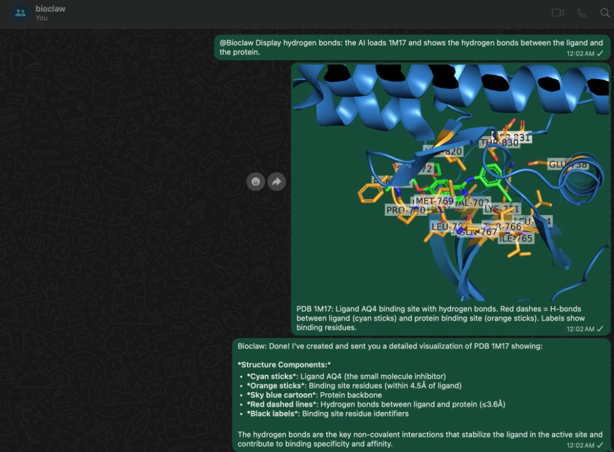
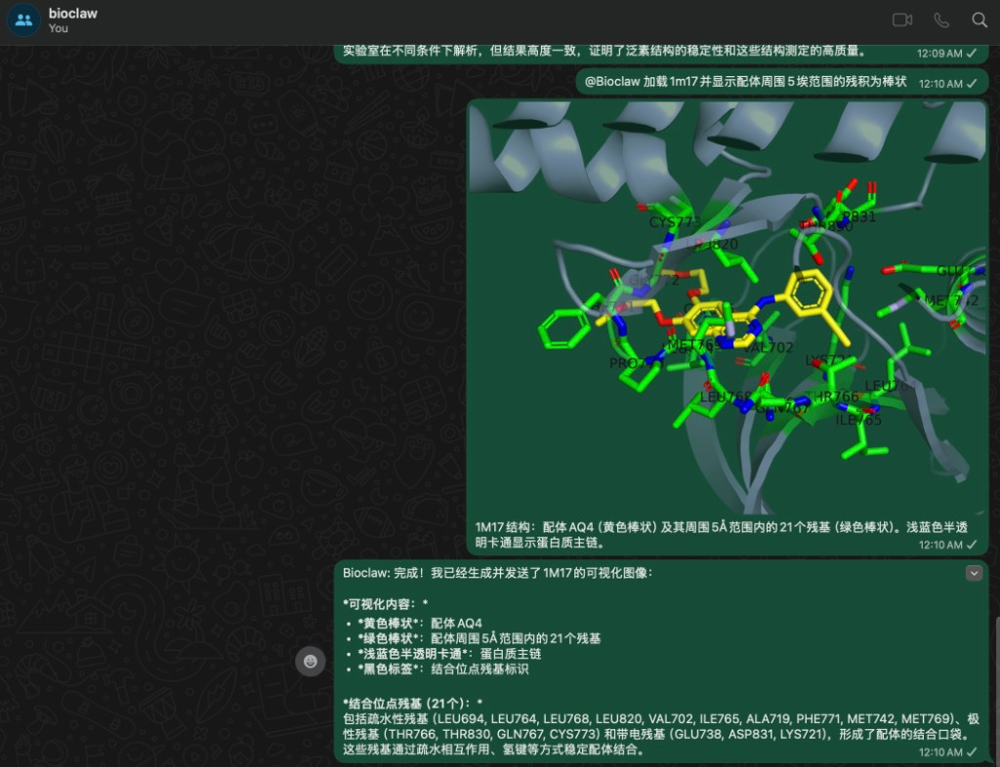

<div align="center">


# BioClaw

### AI-Powered Bioinformatics Research Assistant

[English](README.md) | [简体中文](README.zh-CN.md)

[](https://github.com/Runchuan-BU/BioClaw)
[](https://github.com/Runchuan-BU/BioClaw/blob/main/LICENSE)
[](https://www.biorxiv.org/content/10.1101/2025.07.01.662467v2)
[](https://arxiv.org/abs/2507.02004)

**BioClaw** brings the power of computational biology to messaging platforms and the web. Researchers can run BLAST searches, render protein structures, generate publication-quality plots, perform sequencing QC, and search the literature — all through natural language.

Built on the [NanoClaw](https://github.com/qwibitai/nanoclaw) architecture with bioinformatics tools and skills from the [STELLA](https://github.com/zaixizhang/STELLA) project, powered by the [Claude Agent SDK](https://docs.anthropic.com/en/docs/agents-sdk).

</div>

## Join WeChat Group

Welcome to join our WeChat group to discuss and exchange ideas! Scan the QR code below to join:

<p align="center">
  
  <br/>
  <em>Scan to join the BioClaw community</em>
</p>

## Contents

- [Overview](#overview)
- [Quick Start](#quick-start)
- [Web Dashboard & Chat](#web-dashboard--chat)
- [Multi-Model Support](#multi-model-support)
- [Demo Examples](#demo-examples)
- [System Architecture](#system-architecture)
- [Included Tools](#included-tools)
- [Project Structure](#project-structure)
- [Citation](#citation)
- [License](#license)

## Overview

The rapid growth of biomedical data, tools, and literature has created a fragmented research landscape that outpaces human expertise. Researchers frequently need to switch between command-line bioinformatics tools, visualization software, databases, and literature search engines — often across different machines and environments.

**BioClaw** addresses this by providing a conversational interface to a comprehensive bioinformatics toolkit. Researchers can interact via WhatsApp, Telegram, WeCom, or the built-in web chat to:

- **Sequence Analysis** — Run BLAST searches against NCBI databases, align reads with BWA/minimap2, and call variants
- **Quality Control** — Generate FastQC reports on sequencing data with automated interpretation
- **Structural Biology** — Fetch and render 3D protein structures from PDB with PyMOL
- **Data Visualization** — Create volcano plots, heatmaps, and expression figures from CSV data
- **Literature Search** — Query PubMed for recent papers with structured summaries
- **Workspace Management** — Triage files, recommend analysis steps, and manage shared group workspaces

Results — including images, plots, and structured reports — are delivered directly back to the chat.

## Quick Start

### Prerequisites

- macOS with [Apple Container](https://developer.apple.com/documentation/apple-containers) or Linux with Docker
- Node.js 20+
- Anthropic API key (or Claude Code OAuth token)

### Installation

```bash
# Clone the repository
git clone https://github.com/Runchuan-BU/BioClaw.git
cd BioClaw

# Install dependencies
npm install

# Configure environment
cp .env.example .env
# Edit .env with your API keys

# Build the agent container image
./container/build.sh

# Start BioClaw
npm start
```

### Second Quick Start

Just send this message to [OpenClaw](https://github.com/qwibitai/nanoclaw):

```text
install https://github.com/Runchuan-BU/BioClaw
```

### Usage

**Via messaging platforms** — In any connected WhatsApp/Telegram/WeCom group:
```
@Bioclaw <your request>
```

**Via web chat** — Open `http://localhost:3847` in your browser and start chatting directly.

See the [ExampleTask](ExampleTask/ExampleTask.md) document for 6 ready-to-use demo prompts with expected outputs.

## Web Dashboard & Chat

BioClaw includes a built-in web interface accessible at `http://localhost:3847`.

### Chat Interface

- **Open WebUI-style layout** — Centered conversation area with left sidebar for chat history
- **Group selector** — Choose any registered group to route messages through its configured agent and container
- **File & image upload** — Attach biology data files (FASTA, VCF, BAM, CSV, PDF, etc.) and images directly in chat
- **Chat persistence** — Conversations are saved to localStorage and survive page refreshes
- **Streaming responses** — Real-time token-by-token response display with tool use visualization

### Dashboard Tabs

| Tab | Description |
|-----|-------------|
| **Groups** | All registered messaging groups with agent type, message count, and last activity |
| **Tasks** | Scheduled tasks — view, pause, resume, and inspect run history |
| **Stats** | Activity charts (messages/day, task runs/day, success rate) with 7d/14d/30d period selector |
| **Models** | Configured AI models with connection status, specs, quick test, and daily token usage tracking |
| **Skills** | Installed agent skills (90+ bio tools and container skills) with search and category filters |
| **Containers** | Running container instances with image info |
| **Alerts** | Alert rules for group silence thresholds |
| **Logs** | Live log viewer with auto-scroll and error filtering |

### UI Controls

- **Dark / Light theme** — Toggle in the header, persisted in `localStorage`
- **Language** — Switch between Chinese (中文) and English (EN)
- **Auto-refresh** — Select refresh interval (off / 10s / 30s / 1min / 5min)

## Multi-Model Support

BioClaw supports multiple AI backends. Each group can be configured with a different agent type:

| Agent | Backend | Features |
|-------|---------|----------|
| **Claude** | Anthropic (container) | Full tool use, file I/O, biology skills, persistent sessions |
| **MiniMax** | MiniMax API (OpenAI-compatible) | Chat with reasoning, image understanding, PDF text extraction |
| **Qwen** | Local/remote Qwen (OpenAI-compatible) | Chat with local model, image understanding, PDF text extraction |

Configure via environment variables in `.env`:

```bash
# Claude (required)
ANTHROPIC_API_KEY=sk-ant-...
# or
CLAUDE_CODE_OAUTH_TOKEN=...

# MiniMax (optional)
MINIMAX_API_KEY=sk-...
MINIMAX_BASE_URL=https://api.minimax.chat/v1
MINIMAX_MODEL=MiniMax-M2.5

# Qwen (optional)
QWEN_API_BASE=http://your-qwen-server:8864/v1
QWEN_AUTH_TOKEN=your-token
QWEN_MODEL=your-model-name
```

## Demo Examples

Below are live demonstrations of BioClaw handling real bioinformatics tasks via WhatsApp.

### 1. Workspace Triage & Next Steps
> Analyze files in a shared workspace and recommend the best next analysis steps.

<div align="center">

</div>

---

### 2. FastQC Quality Control
> Run FastQC on paired-end FASTQ files and deliver the QC report with key findings.

<div align="center">

</div>

---

### 3. BLAST Sequence Search
> BLAST a protein sequence against the NCBI nr database and return structured top hits.

<div align="center">

</div>

---

### 4. Volcano Plot Generation
> Create a differential expression volcano plot from a CSV file and interpret the results.

<div align="center">

</div>

---

### 5. Protein Structure Rendering
> Fetch a PDB structure, render it in rainbow coloring with PyMOL, and send the image.

<div align="center">

</div>

---

### 6. PubMed Literature Search
> Search PubMed for recent high-impact papers and provide structured summaries.

<div align="center">

</div>

---

### 7. Hydrogen Bond Analysis
> Visualize hydrogen bonds between a ligand and protein in PDB 1M17.



---

### 8. Binding Site Visualization
> Show residues within 5Å of ligand AQ4 in PDB 1M17.



---

## System Architecture

BioClaw is built on the [NanoClaw](https://github.com/qwibitai/nanoclaw) container-based agent architecture, extended with biomedical tools and domain knowledge from the [STELLA](https://github.com/zaixizhang/STELLA) framework.

```
Channels (WhatsApp/Telegram/WeCom/Web)
         │
         ▼
   Node.js Orchestrator ──► SQLite (state)
         │
         ├──► Claude Container Agent
         │         │
         │    Claude Agent SDK + Bio Tools
         │    (BLAST, SAMtools, BWA, PyMOL, ...)
         │
         ├──► MiniMax API (OpenAI-compatible)
         │
         └──► Qwen API (OpenAI-compatible)
```

**Key design principles (inherited from NanoClaw):**

| Component | Description |
|-----------|-------------|
| **Container Isolation** | Each conversation group runs in its own container with pre-installed bioinformatics tools |
| **Filesystem IPC** | Text and image results are communicated between the agent and orchestrator via the filesystem |
| **Per-Group State** | SQLite database tracks messages, sessions, and group-specific workspaces |
| **Channel Agnostic** | Channels self-register at startup; the orchestrator connects whichever ones have credentials |
| **Multi-Model** | Each group can be configured with a different AI backend (Claude, MiniMax, Qwen) |

**Biomedical capabilities (attributed to STELLA):**

The bioinformatics tool suite and domain-specific skills — including sequence analysis, structural biology, literature mining, and data visualization — draw from the tool ecosystem developed in the [STELLA](https://github.com/zaixizhang/STELLA) project, a self-evolving multi-agent framework for biomedical research.

## Included Tools

### Command-Line Bioinformatics
| Tool | Purpose |
|------|---------|
| **BLAST+** | Sequence similarity search against NCBI databases |
| **SAMtools** | Manipulate alignments in SAM/BAM format |
| **BEDTools** | Genome arithmetic and interval manipulation |
| **BWA** | Burrows-Wheeler short read aligner |
| **minimap2** | Long read and assembly alignment |
| **FastQC** | Sequencing quality control reports |
| **seqtk** | FASTA/FASTQ file manipulation |
| **PyMOL** | Molecular visualization and rendering |

### Python Libraries
| Library | Purpose |
|---------|---------|
| **BioPython** | Biological computation (sequences, PDB, BLAST parsing) |
| **pandas / NumPy / SciPy** | Data manipulation and scientific computing |
| **matplotlib / seaborn** | Publication-quality plotting |
| **scikit-learn** | Machine learning for biological data |
| **RDKit** | Cheminformatics and molecular descriptors |
| **PyDESeq2** | Differential expression analysis |
| **scanpy** | Single-cell RNA-seq analysis |
| **pysam** | SAM/BAM file access from Python |

## Project Structure

```
BioClaw/
├── src/
│   ├── index.ts              # Orchestrator: state, message loop, agent invocation
│   ├── dashboard.ts          # Web dashboard & chat API server
│   ├── dashboard.html        # Single-page dashboard & chat UI
│   ├── channels/
│   │   └── whatsapp.ts       # WhatsApp connection, auth, send/receive
│   ├── container-runner.ts   # Spawns agent containers with mounts
│   ├── task-scheduler.ts     # Runs scheduled tasks
│   ├── router.ts             # Message formatting and outbound routing
│   ├── config.ts             # Trigger pattern, paths, intervals
│   ├── db.ts                 # SQLite operations
│   └── ipc.ts                # IPC watcher and task processing
├── container/
│   ├── Dockerfile            # Agent container with bio tools
│   ├── build.sh              # Container build script
│   ├── agent-runner/         # In-container agent runner
│   └── skills/               # Bio tool skill definitions (90+)
├── groups/                   # Per-group memory and workspace (isolated)
├── store/                    # WhatsApp auth and session data
├── ExampleTask/              # Demo prompts and screenshots
└── README.md
```

## Development

```bash
npm run dev          # Run with hot reload
npm run build        # Compile TypeScript
./container/build.sh # Rebuild agent container (with bio tools)
```

## Citation

BioClaw builds upon the STELLA framework. If you use BioClaw in your research, please cite:

```bibtex
@article{jin2025stella,
  title={STELLA: Towards a Biomedical World Model with Self-Evolving Multimodal Agents},
  author={Jin, Ruofan and Xu, Mingyang and Meng, Fei and Wan, Guancheng and Cai, Qingran and Jiang, Yize and Han, Jin and Chen, Yuanyuan and Lu, Wanqing and Wang, Mengyang and Lan, Zhiqian and Jiang, Yuxuan and Liu, Junhong and Wang, Dongyao and Cong, Le and Zhang, Zaixi},
  journal={bioRxiv},
  year={2025},
  doi={10.1101/2025.07.01.662467}
}
```

## Related Projects

- [STELLA](https://github.com/zaixizhang/STELLA) — Self-Evolving LLM Agent for Biomedical Research
- [NanoClaw](https://github.com/qwibitai/nanoclaw) — Lightweight container-based agent architecture
- [Claude Agent SDK](https://docs.anthropic.com/en/docs/agents-sdk) — Anthropic's SDK for building AI agents

## Acknowledgments

This project was developed in the **Le Cong Lab** at Stanford University and the **Mengdi Wang Lab** at Princeton University.

## License

This project is licensed under the MIT License. See [LICENSE](LICENSE) for details.
