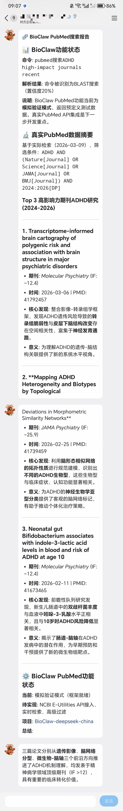

<div align="center">


# BioClaw

### AI-Powered Bioinformatics Research Assistant on WhatsApp

[English](README.md) | [简体中文](README.zh-CN.md)

[](https://github.com/Runchuan-BU/BioClaw)
[](https://github.com/Runchuan-BU/BioClaw/blob/main/LICENSE)
[](https://www.biorxiv.org/content/10.1101/2025.07.01.662467v2)
[](https://arxiv.org/abs/2507.02004)

**BioClaw** brings the power of computational biology directly into WhatsApp group chats. Researchers can run BLAST searches, render protein structures, generate publication-quality plots, perform sequencing QC, and search the literature — all through natural language messages.

Built on the [NanoClaw](https://github.com/qwibitai/nanoclaw) architecture with bioinformatics tools and skills from the [STELLA](https://github.com/zaixizhang/STELLA) project, powered by the [Claude Agent SDK](https://docs.anthropic.com/en/docs/agents-sdk).

</div>

## Join WeChat Group

Welcome to join our WeChat group to discuss and exchange ideas! Scan the QR code below to join:

<p align="center">
  
  <br/>
  <em>Scan to join the BioClaw community</em>
</p>

## Contents

- [Overview](#overview)
- [Quick Start](#quick-start)
- [Demo Examples](#demo-examples)
- [System Architecture](#system-architecture)
- [Included Tools](#included-tools)
- [Project Structure](#project-structure)
- [Citation](#citation)
- [License](#license)

## Overview

The rapid growth of biomedical data, tools, and literature has created a fragmented research landscape that outpaces human expertise. Researchers frequently need to switch between command-line bioinformatics tools, visualization software, databases, and literature search engines — often across different machines and environments.

**BioClaw** addresses this by providing a conversational interface to a comprehensive bioinformatics toolkit. By messaging `@Bioclaw` in a WhatsApp group, researchers can:

- **Sequence Analysis** — Run BLAST searches against NCBI databases, align reads with BWA/minimap2, and call variants
- **Quality Control** — Generate FastQC reports on sequencing data with automated interpretation
- **Structural Biology** — Fetch and render 3D protein structures from PDB with PyMOL
- **Data Visualization** — Create volcano plots, heatmaps, and expression figures from CSV data
- **Literature Search** — Query PubMed for recent papers with structured summaries
- **Workspace Management** — Triage files, recommend analysis steps, and manage shared group workspaces

Results — including images, plots, and structured reports — are delivered directly back to the chat.

## Quick Start

### Prerequisites

- macOS or Linux
- Node.js 20+
- Docker Desktop
- Anthropic API key or OpenRouter API key

### Installation

```bash
# Clone the repository
git clone https://github.com/Runchuan-BU/BioClaw.git
cd BioClaw

# Install dependencies
npm install

# Start BioClaw
npm start
```

### Model Provider Configuration

BioClaw now supports two provider paths:

- **Anthropic** — default, keeps the original Claude Agent SDK flow
- **OpenRouter / OpenAI-compatible** — optional path for OpenRouter and similar `/chat/completions` providers

Create a `.env` file in the project root and choose **one** of the following setups.

**Option A — Anthropic (default)**

```bash
ANTHROPIC_API_KEY=your_anthropic_key
```

**Option B — OpenRouter** (Gemini, DeepSeek, Claude, GPT, and more)

```bash
MODEL_PROVIDER=openrouter
OPENROUTER_API_KEY=sk-or-v1-your-key
OPENROUTER_BASE_URL=https://openrouter.ai/api/v1
OPENROUTER_MODEL=deepseek/deepseek-chat-v3.1
```

Popular model IDs: `deepseek/deepseek-chat-v3.1`, `google/gemini-2.5-flash`, `anthropic/claude-3.5-sonnet`. Full list: [openrouter.ai/models](https://openrouter.ai/models)

**Note:** Use models that support [tool calling](https://openrouter.ai/models?supported_parameters=tools) (e.g. DeepSeek, Gemini, Claude). Session history is preserved within a container session; after idle timeout, a new container starts with a fresh context.

**Generic OpenAI-compatible setup**

```bash
MODEL_PROVIDER=openai-compatible
OPENAI_COMPATIBLE_API_KEY=your_api_key
OPENAI_COMPATIBLE_BASE_URL=https://your-provider.example/v1
OPENAI_COMPATIBLE_MODEL=your-model-name
```

After updating `.env`, restart BioClaw:

```bash
npm run dev
```

When a container starts, `docker logs <container-name>` will show which provider path is active.

### Usage

In any connected chat, simply message:

```
@Bioclaw <your request>
```

## Channel Setup

BioClaw supports multiple messaging platforms. Enable one or more by setting the corresponding environment variables in `.env`.

### WhatsApp (Default)

No credentials needed. On first run, a QR code is printed to the terminal — scan it with your WhatsApp app. Auth state is persisted in `store/auth/`.

### WeCom (Enterprise WeChat)

1. Log in to the [WeCom Admin Console](https://work.weixin.qq.com/wework_admin/frame)
2. Go to **Apps & Mini Programs** > **Smart Robots** > **Create**
3. Select **API mode** with **Long Connection** (not Callback URL)
4. Copy the **Bot ID** and **Secret**
5. Add to `.env`:
   ```
   WECOM_BOT_ID=your-bot-id
   WECOM_SECRET=your-secret
   ```
6. Add the bot to a group in WeCom, then `@` it to start chatting

**Image sending (optional):** To send images in WeCom, create a self-built app in the admin console and configure:
```
WECOM_CORP_ID=your-corp-id
WECOM_AGENT_ID=your-agent-id
WECOM_CORP_SECRET=your-corp-secret
```
The server IP must be added to the app's trusted IP whitelist.

### Feishu / Lark (飞书)

1. Go to the [Feishu Open Platform](https://open.feishu.cn/) and create a **self-built app** (企业自建应用)
2. Enable **Bot** capability under **Add Capabilities**
3. Under **Permissions & Scopes**, grant:
   - `im:message` — Receive messages
   - `im:message:send_as_bot` — Send messages as bot
   - `im:resource` — Download images/files from messages
   - `im:message.group_msg` — Receive group messages (if using in groups)
4. Under **Events & Callbacks**, select **Long Connection** (长连接) mode
5. Subscribe to event: `im.message.receive_v1`
6. Copy the **App ID** and **App Secret**, add to `.env`:
   ```
   FEISHU_APP_ID=cli_your_app_id
   FEISHU_APP_SECRET=your_app_secret
   ```
7. Publish the app version and have the admin approve it
8. Add the bot to a group or send it a direct message to start chatting

**Auto-registration:** New chats are automatically registered — no manual setup needed. By default, they use the `main` group folder. Override with:
```
FEISHU_DEFAULT_FOLDER=my-folder
```

**Multi-bot support:** Up to 3 Feishu bots can run simultaneously (e.g., different agents for different groups):
```
FEISHU2_APP_ID=cli_second_app_id
FEISHU2_APP_SECRET=second_app_secret
FEISHU2_DEFAULT_FOLDER=literature

FEISHU3_APP_ID=cli_third_app_id
FEISHU3_APP_SECRET=third_app_secret
FEISHU3_DEFAULT_FOLDER=qwen-agent
```

<p align="center">
  
  
</p>

### Discord

1. Go to the [Discord Developer Portal](https://discord.com/developers/applications)
2. Click **New Application**, then go to **Bot** > **Add Bot**
3. Enable **MESSAGE CONTENT INTENT** under Privileged Gateway Intents
4. Copy the **Bot Token** and add to `.env`:
   ```
   DISCORD_BOT_TOKEN=your-bot-token
   ```
5. Go to **OAuth2** > **URL Generator**, select scope `bot`, grant permissions: Send Messages, Attach Files, Read Message History
6. Open the generated URL to invite the bot to your Discord server
7. Send a message in any channel — the bot auto-registers and responds

### Disabling a Channel

To run without WhatsApp (e.g., WeCom/Discord only):
```
DISABLE_WHATSAPP=1
```

## Second Quick Start

Just send the message to OpenClaw:

```text
install https://github.com/Runchuan-BU/BioClaw
```

See the [ExampleTask](ExampleTask/ExampleTask.md) document for 6 ready-to-use demo prompts with expected outputs.

## Demo Examples

Below are live demonstrations of BioClaw handling real bioinformatics tasks via WhatsApp.

### 1. Workspace Triage & Next Steps
> Analyze files in a shared workspace and recommend the best next analysis steps.

<div align="center">

</div>

---

### 2. FastQC Quality Control
> Run FastQC on paired-end FASTQ files and deliver the QC report with key findings.

<div align="center">

</div>

---

### 3. BLAST Sequence Search
> BLAST a protein sequence against the NCBI nr database and return structured top hits.

<div align="center">

</div>

---

### 4. Volcano Plot Generation
> Create a differential expression volcano plot from a CSV file and interpret the results.

<div align="center">

</div>

---

### 5. Protein Structure Rendering
> Fetch a PDB structure, render it in rainbow coloring with PyMOL, and send the image.

<div align="center">

</div>

---

### 6. PubMed Literature Search
> Search PubMed for recent high-impact papers and provide structured summaries.

<div align="center">

</div>

---

### 7. Hydrogen Bond Analysis
> Visualize hydrogen bonds between a ligand and protein in PDB 1M17.


---

### 8. Binding Site Visualization
> Show residues within 5Å of ligand AQ4 in PDB 1M17.


---

## System Architecture

BioClaw is built on the [NanoClaw](https://github.com/qwibitai/nanoclaw) container-based agent architecture, extended with biomedical tools and domain knowledge from the [STELLA](https://github.com/zaixizhang/STELLA) framework.

```
WhatsApp ──► Node.js Orchestrator ──► SQLite (state) ──► Docker Container
                                                              │
                                                     Claude Agent SDK
                                                              │
                                                   ┌──────────┴──────────┐
                                                   │   Bioinformatics    │
                                                   │      Toolbox        │
                                                   ├─────────────────────┤
                                                   │ BLAST+  │ SAMtools  │
                                                   │ BWA     │ BEDTools  │
                                                   │ FastQC  │ PyMOL     │
                                                   │ minimap2│ seqtk     │
                                                   ├─────────────────────┤
                                                   │   Python Libraries  │
                                                   ├─────────────────────┤
                                                   │ BioPython │ pandas  │
                                                   │ RDKit     │ scanpy  │
                                                   │ PyDESeq2  │ pysam   │
                                                   │ matplotlib│ seaborn │
                                                   └─────────────────────┘
```

**Key design principles (inherited from NanoClaw):**

| Component | Description |
|-----------|-------------|
| **Container Isolation** | Each conversation group runs in its own Docker container with pre-installed bioinformatics tools |
| **Filesystem IPC** | Text and image results are communicated between the agent and orchestrator via the filesystem |
| **Per-Group State** | SQLite database tracks messages, sessions, and group-specific workspaces |
| **Channel Agnostic** | Channels self-register at startup; the orchestrator connects whichever ones have credentials |

**Biomedical capabilities (attributed to STELLA):**

The bioinformatics tool suite and domain-specific skills — including sequence analysis, structural biology, literature mining, and data visualization — draw from the tool ecosystem developed in the [STELLA](https://github.com/zaixizhang/STELLA) project, a self-evolving multi-agent framework for biomedical research.

## Included Tools

### Command-Line Bioinformatics
| Tool | Purpose |
|------|---------|
| **BLAST+** | Sequence similarity search against NCBI databases |
| **SAMtools** | Manipulate alignments in SAM/BAM format |
| **BEDTools** | Genome arithmetic and interval manipulation |
| **BWA** | Burrows-Wheeler short read aligner |
| **minimap2** | Long read and assembly alignment |
| **FastQC** | Sequencing quality control reports |
| **fastp** | FASTQ filtering and trimming (QC/preprocessing) |
| **MultiQC** | Aggregate QC reports into one summary |
| **seqtk** | FASTA/FASTQ file manipulation |
| **seqkit** | FASTA/FASTQ toolkit (extended) |
| **BCFtools** | Variant calling and VCF/BCF manipulation |
| **tabix** | Index/query compressed VCF/BED (bgzip/tabix) |
| **pigz** | Parallel gzip compression/decompression |
| **SRA Toolkit** | Download data from NCBI SRA (prefetch/fasterq-dump) |
| **Salmon** | RNA-seq transcript quantification |
| **kallisto** | RNA-seq transcript quantification |
| **PyMOL** | Molecular visualization and rendering |

### Python Libraries
| Library | Purpose |
|---------|---------|
| **BioPython** | Biological computation (sequences, PDB, BLAST parsing) |
| **pandas / NumPy / SciPy** | Data manipulation and scientific computing |
| **matplotlib / seaborn** | Publication-quality plotting |
| **scikit-learn** | Machine learning for biological data |
| **RDKit** | Cheminformatics and molecular descriptors |
| **PyDESeq2** | Differential expression analysis |
| **scanpy** | Single-cell RNA-seq analysis |
| **pysam** | SAM/BAM file access from Python |

## Quick Start

### Prerequisites

- macOS or Linux
- Node.js 20+
- Docker Desktop
- Anthropic API key

### Installation

```bash
# Clone the repository
git clone https://github.com/Runchuan-BU/BioClaw.git
cd BioClaw

# Install dependencies
npm install

# Configure environment
cp .env.example .env
# Edit .env with your Anthropic API key

# Build the agent Docker image
docker build -t bioclaw-agent:latest container/

# Start BioClaw (scan the QR code with WhatsApp on first run)
npm start
```

### Usage

In any WhatsApp group where BioClaw is connected, simply message:

```
@Bioclaw <your request>
```

See the [ExampleTask](ExampleTask/ExampleTask.md) document for 6 ready-to-use demo prompts with expected outputs.

## Project Structure

```
BioClaw/
├── bioclaw_logo.jpg           # Project logo
├── ExampleTask/
│   ├── ExampleTask.md         # 6 demo prompts with descriptions
│   ├── 1.jpg                  # Workspace triage demo
│   ├── 2.jpg                  # PubMed search demo
│   ├── 3.jpg                  # Protein structure demo
│   ├── 4.jpg                  # BLAST search demo
│   ├── 5.jpg                  # FastQC QC demo
│   └── 6.jpg                  # Volcano plot demo
└── README.md
```

## Citation

BioClaw builds upon the STELLA framework. If you use BioClaw in your research, please cite:

```bibtex
@article{jin2025stella,
  title={STELLA: Towards a Biomedical World Model with Self-Evolving Multimodal Agents},
  author={Jin, Ruofan and Xu, Mingyang and Meng, Fei and Wan, Guancheng and Cai, Qingran and Jiang, Yize and Han, Jin and Chen, Yuanyuan and Lu, Wanqing and Wang, Mengyang and Lan, Zhiqian and Jiang, Yuxuan and Liu, Junhong and Wang, Dongyao and Cong, Le and Zhang, Zaixi},
  journal={bioRxiv},
  year={2025},
  doi={10.1101/2025.07.01.662467}
}
```

## License

This project is licensed under the MIT License. See [LICENSE](LICENSE) for details.
